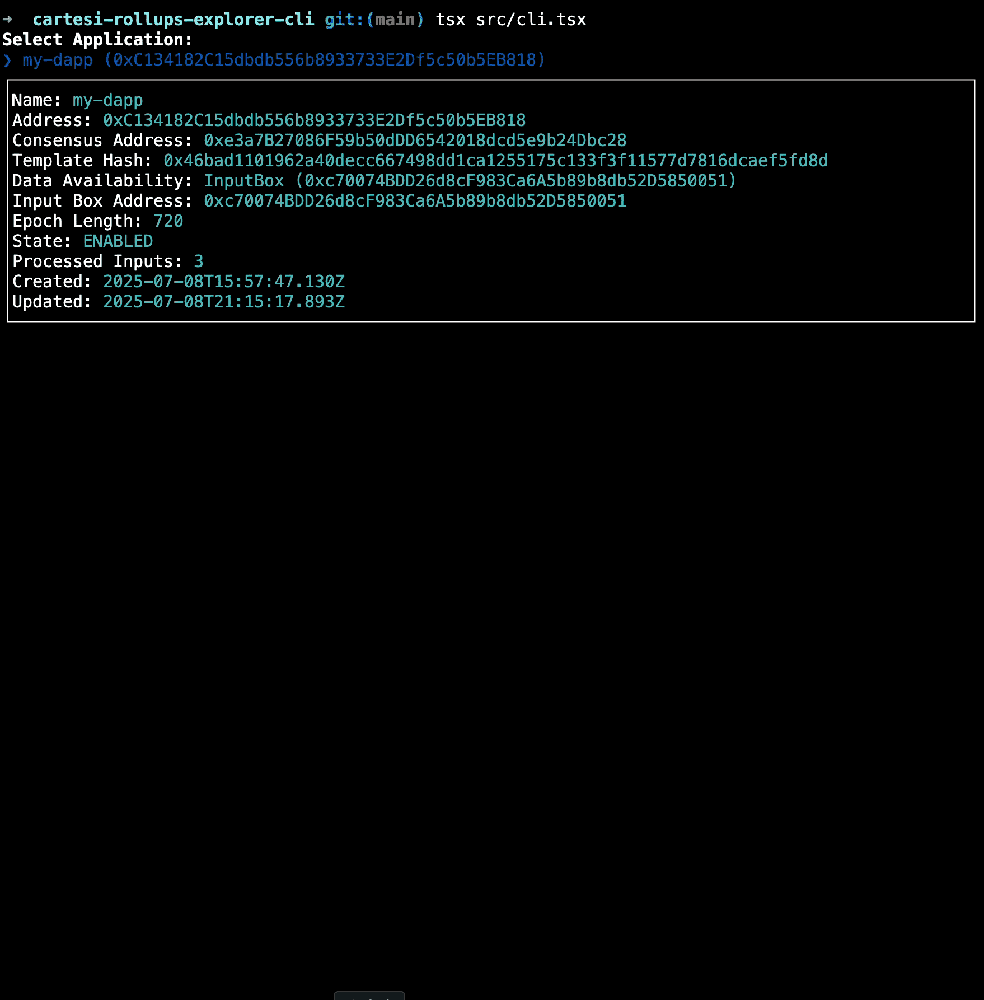

# @tuler/cartesi-rollups-explorer-cli

CLI tool to browse data from Cartesi Rollups RPC.



## Install

```bash
$ npm install --global @tuler/cartesi-rollups-explorer-cli
```

## CLI

```
$ cartesi-rollups-explorer-cli --help

Usage: cli [options] [rpc-url]

A CLI for Cartesi Rollups RPC

Arguments:
  rpc-url     JSON-RPC endpoint (default: "http://127.0.0.1:6751/rpc")

Options:
  -h, --help  display help for command
```

## Build

```shell
pnpm i
pnpm run build
```

## License

Licensed under [Apache-2](./LICENSE).
